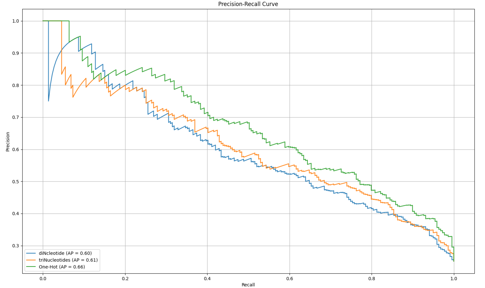

# Comparative Analysis of DNA Sequence Encoding Methods

## Kmer Frequencies (k=2) - Di-nucleotides Encoding:

Di-nucleotide encoding represents DNA sequences by counting the frequency of every possible pair of nucleotides (A, C, G, T) in the sequence. For example, for a sequence "ACGT", it would count occurrences of "AA", "AC", "AG", "AT", "CA", "CC", "CG", "CT", "GA", "GC", "GG", "GT", "TA", "TC", "TG", and "TT".

**Justification:** Di-nucleotide encoding captures local sequence patterns by considering pairs of nucleotides. This encoding is useful for capturing short-range dependencies and motifs within DNA sequences.

## Kmer Frequencies (k=3) - Tri-nucleotides Encoding:

Tri-nucleotide encoding extends the concept of di-nucleotide encoding by considering triplets of nucleotides. It counts the frequency of every possible triplet of nucleotides (A, C, G, T) in the sequence.

**Justification:** Tri-nucleotide encoding captures more complex patterns and dependencies compared to di-nucleotide encoding. By considering triplets of nucleotides, it can capture longer-range interactions within DNA sequences.

## One-Hot Encoding:

One-hot encoding represents each nucleotide in a DNA sequence as a binary vector of length 4, with each position in the vector corresponding to one of the four nucleotides (A, C, G, T). For example, "A" would be represented as [1, 0, 0, 0], "C" as [0, 1, 0, 0], "G" as [0, 0, 1, 0], and "T" as [0, 0, 0, 1].

**Justification:** One-hot encoding provides a straightforward and intuitive representation of DNA sequences. It transforms categorical data (nucleotides) into a numerical format suitable for machine learning algorithms. Additionally, it preserves the identity of each nucleotide without assuming any ordinal relationship between them.

**Note:** For all the encoding methods, padding was used to ensure uniform length for DNA sequences of varying lengths.

## Description of the Tree-based Ensemble Method Used:

Random Forest was selected as the modeling approach for the DNA dataset due to its suitability for handling categorical data and addressing class imbalance. With DNA sequences often presenting categorical data and the dataset exhibiting class imbalance, Random Forest offers several advantages. Firstly, the ensemble nature of Random Forest helps mitigate the impact of imbalanced classes by adjusting class weights inversely proportional to their frequencies. This characteristic ensures that the model does not favor the majority class excessively during training, thus enhancing its capability to make accurate predictions across all classes, even in the presence of imbalanced data distributions. Overall, Random Forest provides a robust and effective solution for modeling the DNA dataset, offering both predictive accuracy and interpretability.

## Justification of the Performance Metric Used to Assess Model Performance:

The F1 score and average precision score were chosen as performance metrics to assess the model's performance due to their suitability for imbalanced classification tasks, which are common in DNA sequence analysis. The F1 score, which balances precision and recall, is well-suited for evaluating binary classification models, providing a single metric that captures both the model's ability to correctly identify positive instances and its ability to avoid misclassifying negative instances. This is particularly important in imbalanced datasets where one class may be significantly outnumbered by the other. Additionally, the average precision score considers the precision-recall trade-off and is particularly useful when the focus is on correctly identifying positive instances, as is often the case in DNA sequence analysis where correctly identifying specific sequences is important. By employing these metrics, the evaluation of model performance is comprehensive and perfectly manages imbalanced classification tasks, thereby providing a clear assessment of the model's effectiveness in accurately classifying DNA sequences.

## Performance Results:

### F1 Score ± Standard Deviation:

| Encoding Method | F1 Score ± Standard Deviation |
| --- | --- |
| Di-nucleotide encoding | 0.429 ± 0.045 |
| Tri-nucleotide encoding | 0.237 ± 0.085 |
| One-hot encoding | 0.306 ± 0.079 |

### Average Precision:

| Encoding Method | Average Precision |
| --- | --- |
| Di-nucleotide encoding | 0.60 |
| Tri-nucleotide encoding | 0.61 |
| One-hot encoding | 0.66 |

## Data Visualization:

## Resources:

- [One-Hot Encoding DNA](https://elferachid.medium.com/one-hot-encoding-dna-92a1c29ba15a)
- [Biostars Discussion on DNA Sequence Encoding](https://www.biostars.org/p/197684/)
